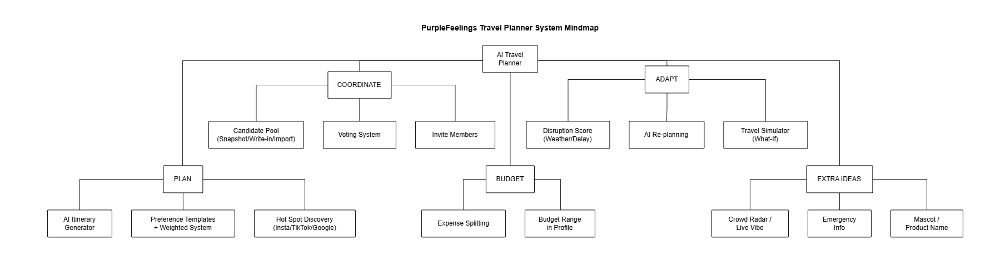
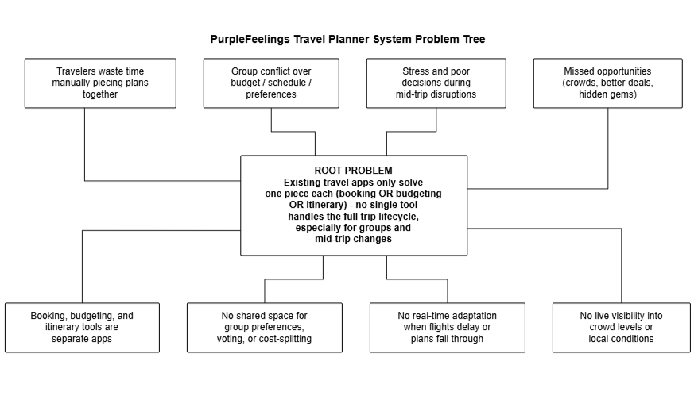
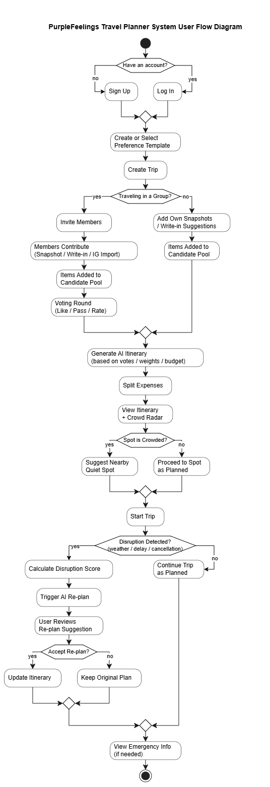
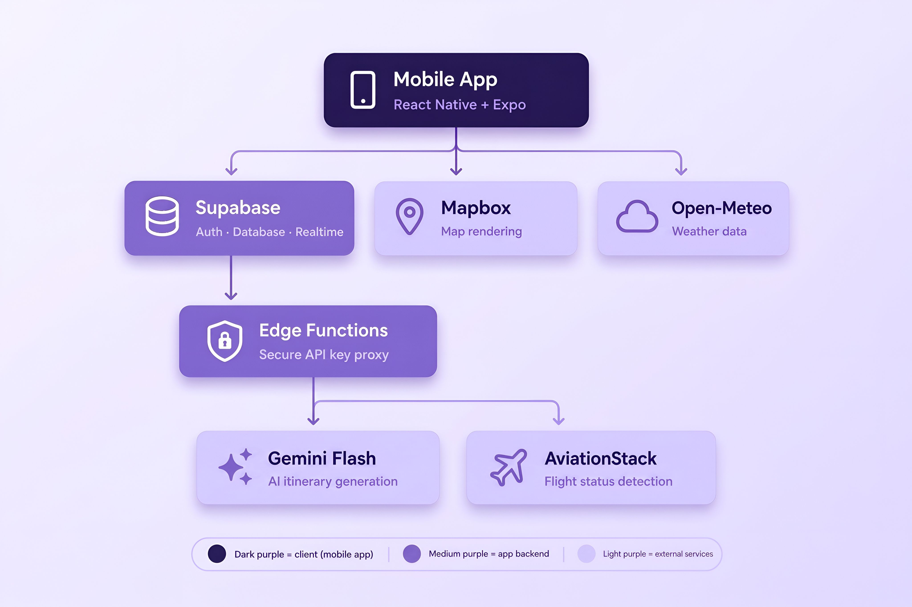

# Eggsplore by Purple Feelings

**Team:** Yii Aik Lui, Anson Wong Leon Sheng, Lee Zhi Wei, Tan Zhi Shing

**Problem Statement:** Group Travel Planning

**Video Presentation:** [Eggsplore Presentation Video →](https://youtu.be/zzKn54QGloY)

**Presentation Slides:** [Eggsplore Presentation Link →](https://www.canva.com/design/DAHUo50Nz2c/i2_mm9cFYN1M4MD1kSzgPw/edit)

---

# 1. Project Overview

## 1.1 Problem

Group travel planning is fragmented, time-consuming, and difficult to adapt when circumstances change. Travellers typically rely on multiple disconnected tools for communication, budgeting, maps, bookings, and itinerary planning.

We identified three main problems:

### Tool Fragmentation

Group travellers must switch between spreadsheets, mapping tools, booking platforms, and other travel services to manage different parts of the same trip.

### Consensus Paralysis & Mental Load

A designated planner often carries most of the responsibility for collecting preferences, researching activities, coordinating decisions, and maintaining the itinerary. Unstructured group chats can also lead to decision fatigue, miscommunication, and lengthy discussions.

### Static & Fragile Itineraries

Traditional itineraries are difficult to adapt when unexpected events occur, such as flight delays, bad weather, or unrealistic travel times. These changes often require manual re-planning during the trip.

---

## 1.2 Key Stakeholders

### Trip Organisers / Leaders

Responsible for coordinating preferences, managing the itinerary, resolving disagreements, and adjusting plans when circumstances change.

### Group Travellers / Participants

Want their individual preferences to be considered while still participating in group decisions without being overwhelmed by lengthy discussions.

### Hospitality & Local Services

Hotels, accommodation providers, and transport services may need timely updates when travel schedules or arrival times change.

---

## 1.3 Existing Solution & Gap

### Wanderlog

Wanderlog provides collaborative trip planning, mapping, and itinerary management. However, collaboration remains largely manual, requiring users to coordinate decisions and adjust itineraries themselves.

This leaves an opportunity for a solution that combines:

- Structured group decision-making
- AI-assisted itinerary generation
- Shared budget management
- Context-aware recommendations
- AI-assisted adaptation when travel conditions change

---

## 1.4 Our Solution — Eggsplore

**Eggsplore** is an AI-powered group travel planning platform designed to support the entire trip journey, from initial planning to on-the-ground travel.

Instead of requiring groups to switch between multiple tools, Eggsplore brings **group decision-making, itinerary planning, budgeting, maps, and AI assistance** into one platform.

The system combines collaborative voting with AI-generated itineraries, while contextual travel information such as weather and flight status can be used to support itinerary adjustments when disruptions occur.

This allows groups to spend less time coordinating logistics and more time enjoying their trip.

---

## 1.5 Key Features

### 1. Collaborative Voting & AI Itinerary Generation

- Provides a candidate pool of activities to reduce the blank-canvas problem when starting a trip.
- Allows group members to vote on proposed activities and express their preferences.
- Uses the selected activities, preferences, budget, and trip constraints to generate an initial itinerary.
- Allows the group to adjust the itinerary and use AI to assist with rescheduling.

### 2. AI-Assisted Disruption Handling

- Monitors relevant flight and weather information to identify potential travel disruptions.
- Uses disruption information to support itinerary adjustments and alternative planning.
- Suggests alternative activities, such as indoor options during bad weather.
- Provides relevant accommodation or travel information to help users respond to disruptions.

### 3. Context-Aware Maps & Place Information

- Displays selected locations through an interactive map.
- Supports thematic **Vibe Layers**, such as Foodie, Tranquility, and Heritage, to help users explore places based on their interests.
- Provides contextual information about selected locations.
- Integrates **Ask AI** into place information so users can ask questions about a selected location and request itinerary adjustments.

### 4. Shared Budget & Trip Management

- Tracks shared trip expenses.
- Supports simple expense-splitting logic for group travellers.
- Keeps trip planning, activities, and budget information within the same workspace.
- Reduces the need to manage trip information across separate spreadsheets and applications.

# 2. Ideation & Process 

## 2.1 Ideas We Considered

| Idea | Status | Why it was dropped / kept |
|---|---|---|
| AI itinerary generator (based on group/individual interests + budget) | Chosen | **Core MVP feature;** directly solves the primary pain point of fragmented trip planning. |
| Candidate pool + voting (👍/👎, mapped internally to a weighted score) | Chosen | **Low user friction;** enables efficient group consensus without forcing users to rate every option. |
| Preference profile (weighted 0–100% categories, reusable templates) | Chosen | **Essential data layer;** feeds both the AI generation and the group voting logic. |
| Budget tracker + expense split logic | Chosen | **Core requirement;** directly addresses the brief's financial planning criteria. |
| Live map — crowd radar, weather, "Ask AI" on a place | Chosen | **High demo value;** directly solves the "avoid long queues" requirement. |
| Dynamic AI re-planning (disruption detection, e.g. flight delay) | Chosen | **Must-have requirement;** demonstrates advanced AI-assisted itinerary recovery when travel disruptions occur. |
| Flight/hotel price estimate + booking deep-link | Chosen (stretch) | **Fulfills live pricing criteria;** uses a feasible mock + redirect approach without requiring actual API partnership. |
| My Notes (private, per-trip notes) | Chosen | **High utility;** separates personal packing lists from the shared group itinerary. |
| Emergency contact / destination info | Chosen | **High safety value with low implementation cost;** fits naturally into the UI. |
| Scraping Instagram/TikTok for "hot spot" content | Dropped | **Copyright & ToS risks;** replaced with safe, AI-generated destination summaries. |
| Live booking API integration (real transactions) | Dropped | **High API friction;** real airline/OTA partner approvals are not obtainable within a hackathon timeline. |
| Travel "what-if" simulator | Dropped | **High build complexity;** moved to the post-MVP roadmap to protect core development time. |
| Trip compatibility score | Dropped | **"Nice-to-have" feature;** cut to prioritize essential group planning mechanics. |
| Real payment / settlement processing | Dropped | **Out of scope;** full financial integration is not required for a conceptual prototype. |
| Multi-language / multi-currency support | Dropped | **Scope creep;** adds engineering surface without demonstrating the core AI/group innovations. |

##  2.2 Ideation Boards 

### Mindmap — Initial Brainstorming

Our initial mindmap split the problem into four pillars — **Plan, Coordinate, Budget, and Adapt** — with an “Extra Ideas” section for ideas that did not yet fit into a specific area. Ideas such as social media scraping and the What-If simulator were later dropped during scoping (see Section 2.1).

### Problem Tree — Problem Analysis

The problem tree maps the root problem — existing travel tools often solve only one part of the trip-planning process — against its upstream causes and downstream effects. This helped shape which features were prioritised for the MVP.

### User Flow — Solution Development

This early end-to-end flow maps the journey from sign-up through group voting, AI itinerary generation, and disruption handling. The overall flow remained relevant, while some steps, such as Instagram import and the calculated disruption score, were simplified during implementation.
## 2.3 Mentor Consultation
### Date: 9/9/2026
### Mentor: Teh Ming En
### Feedback Received
During our mentoring session, we received the following key notes and suggestions:
* **UI & Branding Validation:** The mentor praised the overall user interface, color scheme, and the integration of our eggplant mascot, noting it gave the app a strong, modern visual identity.
* **API Cost Optimization:** Suggested removing the live crowd status indicator from the standard location detail card. Instead, we should let the AI answer crowd-related queries within the chatbot to significantly reduce unnecessary AI token/API costs upon page load.
* **Pitch Focus:** Advised us to decide on and heavily emphasize our primary "killer feature" during the pitching session rather than treating all features equally.
* **Voting Feature Enhancement:** Suggested upgrading the group voting feature so that once the group finishes voting on destinations, the group leader can prompt the AI to automatically arrange the entire itinerary based on those specific voting results.

### What Was Changed
Based on the mentor's feedback, we implemented the following changes:
* **Optimized Map UI:** We removed the static crowd indicator from the location detail card. Crowd status related inquiries are now handled exclusively on-demand via the location-specific 'Ask AI' chatbot, which uses historical data averages to save on real-time API costs.
* **AI-Generated Itineraries:** We integrated the mentor's voting suggestion into our core flow. Now, once voting concludes, the system generates an AI-drafted itinerary based on the winning locations, which the leader can review before confirming.

# 3. Design & Prototype 
UI Prototype: [ Eggsplore Prototype Link →](https://www.figma.com/design/PNFHuNDkooRWAByioQdyAj/PurpleFeelings?node-id=0-1&t=nNVmyPoX7HaqfyD4-1)

## 3.1 Key Features Explanation & Interactions
Detailed explanations of the key features, UI screens, and interactions are provided in the **“Key Features Explanation & Interactions”** section of our Figma file.

**[[View the complete UI design and interaction details in Figma →]](https://www.figma.com/design/PNFHuNDkooRWAByioQdyAj/PurpleFeelings?node-id=0-1&t=nNVmyPoX7HaqfyD4-1)**

# 4. What Makes It Different

While most travel planning apps act as static digital notebooks, Eggsplore differentiates itself by acting as an active, context-aware travel assistant. Here is a breakdown of our novel features and what makes them highly original:

## 4.1 Collaborative AI-Assisted Voting System
**How it works:** When a group selects a destination (e.g., Osaka), the system eliminates the "blank page" syndrome by pre-loading default hotspots like USJ. Group members can then propose their own candidates using multi-modal inputs: pasting a link, uploading a photo for AI recognition, or manual entry with up to three custom tags. Once voting concludes, the group leader hits "View Result," and the AI generates a complete first draft of the itinerary based on the group's preferences. The leader retains manual control to drag, drop, and edit before publishing the final plan.

**The Twist (Originality):** Group travel planning usually devolves into chaotic group chats. We turned it into a structured, democratic process where AI acts as the mediator and  seamlessly transforms a collection of individual votes into a logical, executable schedule. 

## 4.2 Proactive Disruption Handling
**How it works:** Users input their flight details, and our system tracks them silently in the background alongside local weather conditions. If a flight is delayed, the user clicks "Review Impact," and the AI immediately shifts the entire schedule to match the new timeline, even surfacing the accommodation's phone number for quick updates. In the event of weather disruptions, the AI searches the tags from the initial voting stage to suggest nearby, weather-appropriate alternatives that fit the group's established vibe. 

**The Twist (Originality):** Most travel apps stop being useful the moment the trip begins. EGGSPLORE provides active crisis management. It doesn't just notify you that your plan is ruined; it provides one-tap recovery solutions, automatically recalculating logistics and sourcing alternatives so the user doesn't have to panic-search on the side of the road.

## 4.3 Context-Aware Map & Executable AI Chatbots
**How it works:** The map interface is upgraded with two distinct intelligent systems:
* **Vibe Layers:** Instead of basic category filters, the map uses thematic spatial sorting. Toggling a "Foodie," "Tranquility," or "Heritage" layer dims irrelevant POIs and highlights matching zones based on location metadata, organizing complex data without visual clutter.
* **Targeted 'Ask AI' (Location Context):** Built directly into the location's bottom sheet, this chat is locked to that specific Point of Interest. If a user asks about crowd levels, the AI retrieves targeted historical data and generates smart follow-up action buttons.
* **Global Context-Aware AI (Trip Alerts):** Accessed via the notification bell, this system monitors global logistics. If shifting weather is detected, it pushes a proactive banner with an inline button to instantly generate indoor backups. If a user tries to add a stop that is physically too far away, it calculates transit time, flags the logistical error, and embeds a solution in the chat.

**The Twist (Originality):** We bridge the gap between conversational AI and app functionality. Instead of the AI just giving advice that the user then has to manually execute, our chatbot generates executable commands (Action Buttons). Users can automatically reschedule stops, alter routing, or apply filters straight from the chat interface, eliminating manual data entry entirely.

# 5. Technical Architecture & Feasibility

## 5.1 Technical Viability & Tech Stack

### Mobile Frontend

| Technology | Purpose | Rationale | Constraint |
|---|---|---|---|
| **React Native + Expo** | Cross-platform mobile app development | One codebase for iOS and Android, with fast development and testing suitable for a hackathon | — |
| **NativeWind** | UI styling | Tailwind-based styling for consistent spacing, colours, and design tokens across screens | — |

### Backend & Data

| Technology | Purpose | Rationale | Constraint |
|---|---|---|---|
| **Supabase** — Postgres, Auth, Realtime, Edge Functions, Storage in one platform | Single backend covering: relational database, user login, live data sync, and secure server-side logic | Postgres fits relational trip/member/expense/itinerary data cleanly; **Realtime** powers live updates for group voting and shared trip data; **Edge Functions** run AI/external API calls server-side so keys never ship inside the mobile app; **Auth** supports Google and Email login with built-in security policies | Free-tier usage limits and inactivity pausing make it suitable for demo scale, but larger-scale deployment would require a paid plan and higher capacity |

### AI

| Technology | Purpose | Rationale | Constraint |
|---|---|---|---|
| **Google Gemini Flash** | AI itinerary generation, Ask AI, and re-planning | Fast and cost-effective; supports structured JSON output for rendering AI results directly in the UI | Free-tier rate limits may restrict simultaneous AI requests during a live demo |

### Maps & Weather

| Technology | Purpose | Rationale | Constraint |
|---|---|---|---|
| **Mapbox** | Map rendering and location pins | Customisable styling to match brand; no billing account required to get started | Requires live network connectivity for map tiles — no offline fallback |
| **Open-Meteo** | Weather data | Free, no API key required, reducing integration complexity |— |

### Travel Data & Notifications

| Technology / Approach | Purpose | Rationale | Constraint |
|---|---|---|---|
| **AviationStack** | Flight status and delay detection | Looks up status via flight number + date — public flight data, no airline partnership or ticket/PNR needed | Free tier (~100 calls/month) limits live API usage; the demo uses a manual delay trigger to reliably demonstrate the full disruption-handling flow |
| **Mock Pricing Dataset** | Flight and hotel price estimates | Avoids dependency on partner-only booking APIs during the hackathon | Prices are simulated, not live; "book" action deep-links to a real external search page instead of a live transaction |
| **Expo Notifications** | Push notifications | Integrates natively with the Expo ecosystem for disruption alerts | — |

### Deployment

| Technology | Purpose | Constraint |
|---|---|---|
| **Expo EAS Build** | Builds installable mobile apps for testing/distribution | Free tier caps monthly cloud build count — plan builds around key milestones rather than continuous rebuilding |
| **Expo Go** | Rapid testing and live demonstration on mobile devices | — |

## 5.2 System Architecture Diagram

Our architecture follows a serverless BaaS model rather than microservices — the better fit for a small team on a hackathon timeline. The mobile app (React Native + Expo) connects directly to Supabase for auth/database/realtime, plus Mapbox and Open-Meteo, since none of these need a secret key. Gemini Flash and AviationStack do need key protection, so those calls are routed through Supabase Edge Functions, keeping the keys server-side and never bundled into the app.

---

## 5.3 Planning & Scope Realism / Resource & Time Awareness

### Scope: MVP vs Stretch

| Feature | Scope | Description |
|---|---|---|
| **AI Itinerary Generator** | **MVP** | Generates itineraries based on individual/group interests and budget |
| **Candidate Pool + Voting** | **MVP** | Allows group members to vote on activities and uses the selected activities to support AI-assisted itinerary rescheduling |
| **Budget Tracker + Split Logic** | **MVP** | Tracks trip expenses and supports equal or category-based splitting |
| **Preference Profile** | **MVP** | Stores user preferences to personalise itinerary generation |
| **Map + Place Information** | **MVP** | Displays selected places, map pins, and relevant place information |
| **Ask AI** | **MVP** | Allows users to ask AI questions about a selected place |
| **Automatic Background Flight Monitoring** | **Stretch** | Continuously monitors flight status and triggers AI-assisted itinerary re-planning when a delay is detected. |
| **Flight/Hotel Price Estimates** | **Stretch** | Provides estimated travel and accommodation prices with external booking deep-links |
| **Notification Center** | **Stretch** | Provides alerts for travel disruptions and other trip updates |

### Build Plan (Phase-based)

| Phase | Focus |
|---|---|
| Phase 1 — Foundation | Supabase schema (trips/members/expenses/itinerary), Auth, core navigation shell |
| Phase 2 — Core Features | AI itinerary generation, Candidate pool/voting, Budget split logic |
| Phase 3 — Integration & Polish | Map + AI chat, disruption flow (manual-trigger version), mascot UI polish, demo rehearsal |

### Resource & Delivery Feasibility

- **Time:** The phased plan prioritises a small, functional MVP first, with higher-risk features such as automatic background flight monitoring and notifications treated as stretch features.
- **Skills:** React Native, Expo, TypeScript, and Supabase allow the team to build with familiar web/mobile development technologies without maintaining a separate backend.
- **Cost:** The MVP relies mainly on free-tier services; AI API usage is the main expected variable cost at demo scale.

---

# Summary  
Eggsplore is an all-in-one AI travel planning platform engineered to eliminate the tool fragmentation, decision fatigue, and logistical friction of group trips. While existing competitors act as static digital notebooks, Eggsplore serves as an active, context-aware travel assistant that dynamically adapts to user needs and real-world disruptions.

## Core Innovations

**Collaborative Voting & Smart Drafting:** Replaces chaotic group chats with a structured, democratic voting system. Once voting concludes, the AI automatically generates an optimized, executable first-draft itinerary based on the group's preferences.

**Proactive Disruption Handling:** Uses flight and weather information to support disruption detection and AI-assisted itinerary recovery. If a delay or storm occurs, the AI provides one-tap recovery solutions by recalculating logistics and sourcing vibe-matched alternatives.

**Context-Aware Maps & Executable AI:** Upgrades standard maps with thematic "Vibe Layers" for spatial sorting. It features dual AI chatbots that generate smart follow-up action buttons, allowing users to automatically reschedule stops or alter routing directly from the chat without manual data entry.

## Technical Execution & Process

Built as a cross-platform mobile app using React Native (Expo), styled with NativeWind, and powered by a Supabase backend. The AI logic is driven by Google Gemini Flash, integrated with Mapbox and Open-Meteo. The architecture and UI were heavily refined through mentor feedback, specifically optimizing the app to reduce AI token costs by shifting live crowd data into on-demand chat prompts, ensuring a highly scalable and cost-effective MVP.

