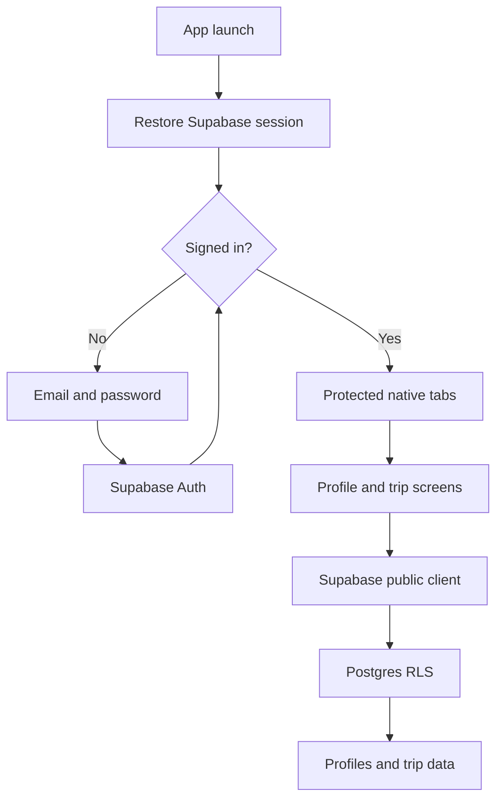

# Eggsplore Architecture

## Platform and scope

The executable application is React Native + Expo SDK 57, Expo Router,
TypeScript, NativeWind 4, and Supabase. Android and iOS use native views. Expo
web is a secondary preview target. There are no Next.js routes, server actions,
browser-only form components, or Next.js build dependencies.

This is a migration of the uploaded foundation, not an implementation of every
feature described in the product pitch. See the status table in README.md.

## Architecture tree

```text
eggsplore/
|-- src/
|   |-- app/                         # Expo Router: routes only
|   |   |-- _layout.tsx              # Providers + session-protected stack
|   |   |-- index.tsx                # Login/home redirect
|   |   |-- login.tsx                # Email/password entry
|   |   |-- +not-found.tsx           # Invalid route fallback
|   |   |-- (tabs)/
|   |   |   |-- _layout.tsx          # Native bottom tab navigation
|   |   |   |-- home.tsx
|   |   |   |-- trips.tsx
|   |   |   |-- map.tsx
|   |   |   `-- profile.tsx
|   |   |-- profile/new.tsx          # Create/edit travel preference
|   |   `-- trips/
|   |       |-- create.tsx
|   |       `-- [id].tsx             # Basic trip detail
|   |-- components/ui/              # A: shared native components
|   |   |-- Button.tsx
|   |   |-- Card.tsx
|   |   |-- BottomSheet.tsx
|   |   |-- Field.tsx
|   |   |-- Screen.tsx               # Safe area, keyboard, scroll, messages
|   |   `-- index.ts
|   |-- features/
|   |   |-- auth/                   # A: login + session lifecycle
|   |   |   |-- AuthProvider.tsx
|   |   |   |-- useAuth.ts
|   |   |   `-- LoginScreen.tsx
|   |   |-- home/HomeScreen.tsx     # A: branded home and entry points
|   |   |-- profile/                # A UI; B consumes preferences
|   |   |   |-- ProfileScreen.tsx
|   |   |   |-- PreferenceScreen.tsx
|   |   |   |-- service.ts          # DB reads and guarded updates
|   |   |   |-- useProfile.ts
|   |   |   |-- types.ts
|   |   |   `-- options.ts
|   |   |-- trips/                  # Shared foundation for B/C/D
|   |   |   |-- CreateTripScreen.tsx
|   |   |   |-- TripsScreen.tsx
|   |   |   |-- TripDetailScreen.tsx
|   |   |   |-- TripCard.tsx
|   |   |   |-- model.ts            # Dates, filters, validation
|   |   |   `-- useTrips.ts
|   |   |-- decision-engine/README.md # B: planned work, not implemented
|   |   |-- live-assistant/
|   |   |   |-- MapScreen.tsx       # C: honest placeholder
|   |   |   `-- README.md
|   |   `-- finances/README.md      # D: planned work, not implemented
|   |-- lib/
|   |   |-- supabase.ts             # Public client + native session storage
|   |   `-- errors.ts               # Handles Error and Supabase error objects
|   |-- styles/theme.ts             # Native colour tokens
|   `-- types/styles.d.ts
|-- assets/
|   |-- eggsplore-logo.png
|   |-- home-hero-background.png
|   `-- home-hero-mascot.png
|-- supabase/
|   |-- migrations/001_foundation.sql # Original initial schema; unchanged
|   `-- verify-foundation.sql         # Read-only checks
|-- tests/trips.test.ts
|-- docs/
|   |-- START-HERE.md                # Windows, Expo Go, EAS, GitHub
|   |-- MIGRATION.md                 # Old-to-new mapping and parity notes
|   |-- VALIDATION.md                # Recorded verification and limitations
|   `-- PROJECT-PROPOSAL.md          # Original README, historical only
|-- README.md
|-- architecture.md
|-- app.json                         # App name, scheme, plugins, platforms
|-- eas.json                         # Development/preview/production profiles
|-- package.json                     # Scripts and direct dependencies
|-- package-lock.json                # Reproducible versions for teammates
|-- tsconfig.json
|-- babel.config.js                  # Expo + NativeWind transform
|-- metro.config.js                  # Metro + NativeWind
|-- tailwind.config.js               # NativeWind design tokens
|-- global.css                       # NativeWind directives, not web layout
|-- nativewind-env.d.ts
|-- .env.example                     # Public config names, no actual keys
`-- .gitignore
```

## Runtime flow



AuthProvider subscribes to auth changes and restores the saved session. AppState
starts/stops token refresh as the app enters/leaves the foreground. Supabase uses
AsyncStorage and processLock following its native quickstart. AsyncStorage is
not encrypted storage: do not describe it as a secure vault. Production teams
should review session-storage and device-compromise requirements.

Stack.Protected removes authenticated screens on logout; it is a UI guard, not
a database security boundary. RLS is still mandatory. Signup creates a profile
through the existing database trigger. Do not insert profiles from the client.

## Team ownership

| Module | Owner's files | Responsibility | Current state |
| --- | --- | --- | --- |
| A: Foundation | app layouts, components/ui, features/auth, features/home, features/profile, lib, styles, supabase | Schema, RLS, email auth, native shell, common controls, account/profile screens | Implemented migration |
| B: Group Decision Engine | features/decision-engine, shared features/trips; new migrations and Edge Functions when added | Read preference profiles, candidate pool, member voting, AI itinerary generation and leader approval | Preferences and trip foundation exist; engine planned |
| C: Live AI Assistant | features/live-assistant; future Supabase Edge Functions | Mapbox rendering, POIs, Ask AI, Open-Meteo, flight disruptions and proposed itinerary changes | Map placeholder only |
| D: Money & Logistics | features/finances; future functions and migrations | Expenses, split balances, explicit mock pricing, booking links, notifications | Existing expenses table only |

Only A should coordinate changes to shared auth, navigation, theme and baseline
schema. B/C/D can add feature routes, but discuss shared contracts first. Route
files should remain thin exports; screen/data logic belongs in features.

### Which module owns the map?

C owns the map and place selection. D consumes coordinates, estimated distance,
travel time and transport mode for cost estimates. B consumes place identifiers
and coordinates for candidates and itinerary stops. Do not build separate maps
for each module. Agree on a future PlaceRef contract containing id, name,
latitude and longitude before implementing the integrations. This contract is
planned, not an existing API.

## Existing database contracts

| Table | Purpose | Client rules from the foundation migration |
| --- | --- | --- |
| profiles | Account identity, preference JSON, private emergency contact JSON | Only the matching authenticated user can read/update allowed columns |
| trips | Title, destination, date range, owner | Members/owner read; owner creates/updates/deletes |
| trip_members | Trip membership and role | Owner adds/removes ordinary members; trigger adds owner |
| itinerary_items | Ordered stops, locations, times | Members read; owner writes |
| expenses | Amount, payer, category per trip | Members read; owner writes with payer-membership checks |

`profiles.preferences.profiles` stores reusable travel styles, not auth accounts.
Fields retained from the web implementation: id, name, emoji, tags, category,
pace, companion, spendingOrder, interests, createdAt. Legacy profiles that only
have name/emoji/tags still display and can be edited. The UI no longer pretends
unsaved demo profiles are user data. New profiles begin with an empty list.

`profiles.preferences.settings` retains notifications and units.
`profiles.emergency_contact` retains name, phone, relationship, destinationNotes.
Profile writes re-read the latest JSON and merge related fields. An updated_at
comparison rejects concurrent conflicting writes instead of silently replacing
another device's edits. Keep the foundation updated_at trigger enabled.

Home/Trips query the trips table under RLS, including trips owned by or shared
with the user. Creating a trip uses auth user.id as owner_id; the database owner
trigger creates membership. A date-less trip appears under Upcoming. Boundary
dates are inclusive and evaluated using the device's local calendar.

## Planned schema work

Do not assume a table exists because the pitch describes it. B needs candidates,
votes and possibly normalized preference weights. D needs split participants,
shares, authorship and notification state. C needs agreed place/disruption data
contracts. Add numbered migrations after inspecting the deployed schema; never
drop/recreate foundation tables to continue development.

Only expose public profile fields to other trip members through a separately
designed safe directory. Do not loosen profiles SELECT RLS to expose private
emergency contacts. Test authorization with two real users, not just the SQL
editor's privileged role. Realtime publications must be configured deliberately.

## Backend and secrets

Supabase URL and publishable/anon key are EXPO_PUBLIC values. Gemini and flight
provider secrets belong in Supabase Edge Functions, with JWT and trip-membership
checks before performing requests. Return validated data; AI-generated actions
must not bypass owner permissions or silently overwrite an itinerary.

No Edge Functions or Python service were provided in the upload. The old Python
requirements file is not needed to run this app. Add backend tooling only when
a backend implementation actually needs it. Never place service_role or secret
keys in Expo environment variables.

## Native-specific decisions

- Use Expo Router Tabs/Stack, not a manually drawn browser navigation bar.
- Use the OS status bar and safe areas, not fake time/battery graphics.
- Use React Native Modal for BottomSheet, with Android back dismissal and keyboard avoidance.
- Use native reorder buttons for spending priorities instead of HTML drag/drop.
- Bundle the three provided PNG assets with require(), not /public URLs.
- Mapbox's native library requires a development build; it is not installed yet.
- Notification preference is persisted, but permission requests, tokens, delivery
  and background jobs remain planned work.
- No automatic flight polling or background execution is claimed by this release.

## Team acceptance checklist

- [ ] Every teammate installs from package-lock with npm ci.
- [ ] Configure each machine's ignored .env with the same public Supabase project values.
- [ ] Validate login/signup on Android and iOS; test confirmation settings separately.
- [ ] Relaunch and background/foreground the app to verify session persistence.
- [ ] Log out; device back navigation must not reveal authenticated screens.
- [ ] Create/edit/delete preference profiles and reopen Profile to confirm persistence.
- [ ] Update account, emergency contact, notes, units, notification preference.
- [ ] Verify wrong current password fails and password changes work.
- [ ] Create a trip; confirm owner membership trigger and all date filters.
- [ ] With a second user, confirm RLS denies private profiles and unshared trips.
- [ ] Test keyboard, safe areas, long names, font scaling and Android back in sheets.
- [ ] B/C/D agree data contracts before adding tables/functions/routes.
- [ ] Use development builds before native Mapbox or remote push integration.

Read docs/VALIDATION.md for automated checks actually performed. Unchecked
device/backend acceptance items are not implied to have passed.
